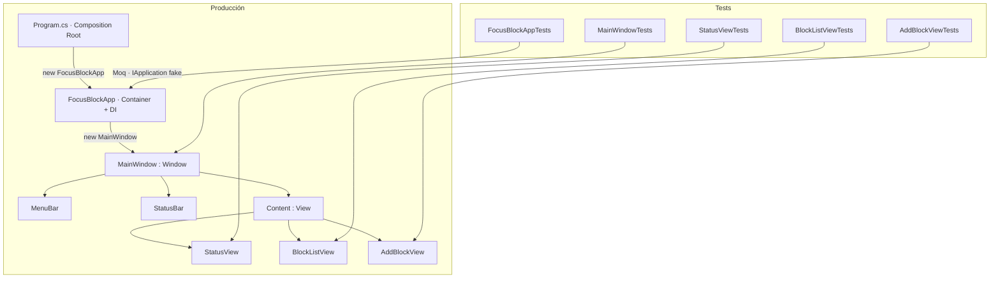
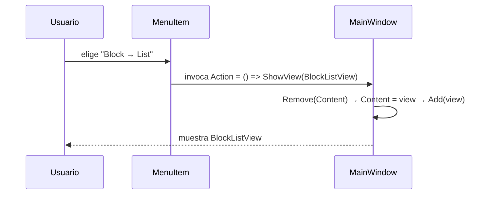

# Diagramas — Fase 1: Esqueleto TUI

Diagramas de componentes y navegación de la Fase 1. Renderizan en GitHub (Mermaid).

## 1. Estructura y conexiones de archivos

Quién depende de quién, y dónde vive cada patrón. Los tests (abajo) apuntan a las mismas clases que usa la producción — esa es la base de la testabilidad.

**Patrones marcados:** Composition Root (`Program.cs`) · DI (`FocusBlockApp(IApplication)`) · Container/Presentational (`FocusBlockApp` orquesta, las vistas presentan) · Test Doubles (Moq en los tests).

## 2. Flujo de navegación

Qué pasa cuando el usuario elige un ítem del menú: el `Action` (delegado) dispara `ShowView`, que intercambia el `Content`.

**Clave:** el `Action` es el *disparador* (qué pasa al hacer clic); `ShowView` es la *operación* (cómo se hace el cambio).