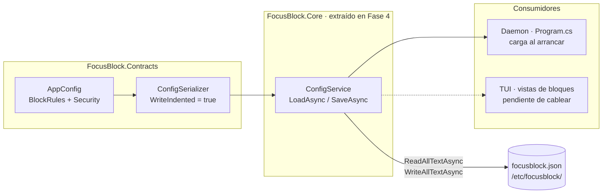
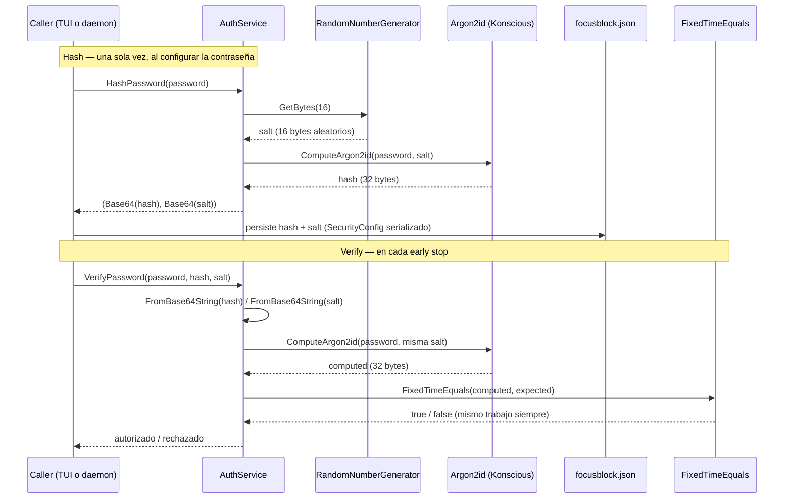

# Diagramas — Fase 2: Configuración y Hashing

El stack de config y el ciclo de vida de una contraseña Argon2id, que en prosa es fácil de perder.

## 1. El stack de configuración

Del modelo en memoria al archivo en disco: qué produce qué y quién consume el resultado.

**Clave:** las flechas siguen el **flujo de datos** (modelo → serializer → service → archivo), no la
dirección de dependencia. La dependencia real va al revés: `ConfigService` conoce a
`ConfigSerializer` y este conoce a `AppConfig`; los modelos no saben que existen. Ese es el principio
de inversión de dependencias aplicado al stack. La línea punteada a la TUI marca lo planificado: hoy
solo el daemon carga la config en runtime.

**Patrones marcados:** DTO de configuración (`AppConfig` y sus partes) · Serializer estático con
opciones cacheadas (`ConfigSerializer`) · Service con path inyectado (`ConfigService`, seam de
filesystem) · extracción de `Core` para compartir entre TUI y daemon (Fase 4).

## 2. Argon2id: hash y verificación

El ciclo completo de la contraseña: se genera una sal, se calcula la huella y se guarda; para
verificar se recalcula con la misma sal y se compara en tiempo constante.

**Clave:** la sal se **guarda junto al hash** porque no es secreta: sin ella no se puede repetir el
cálculo. La verificación **recalcula**, nunca descifra. `FixedTimeEquals` compara en tiempo constante
para no filtrar por timing cuántos bytes iniciales coinciden; el hash viaja y se persiste en Base64
porque JSON no admite bytes binarios arbitrarios.

**Patrones marcados:** CSPRNG para la sal (`RandomNumberGenerator`) · función de hash memory-hard
(Argon2id con 16 MB y 3 iteraciones) · comparación de tiempo constante
(`CryptographicOperations.FixedTimeEquals`) · persistencia Base64 en `SecurityConfig`.
