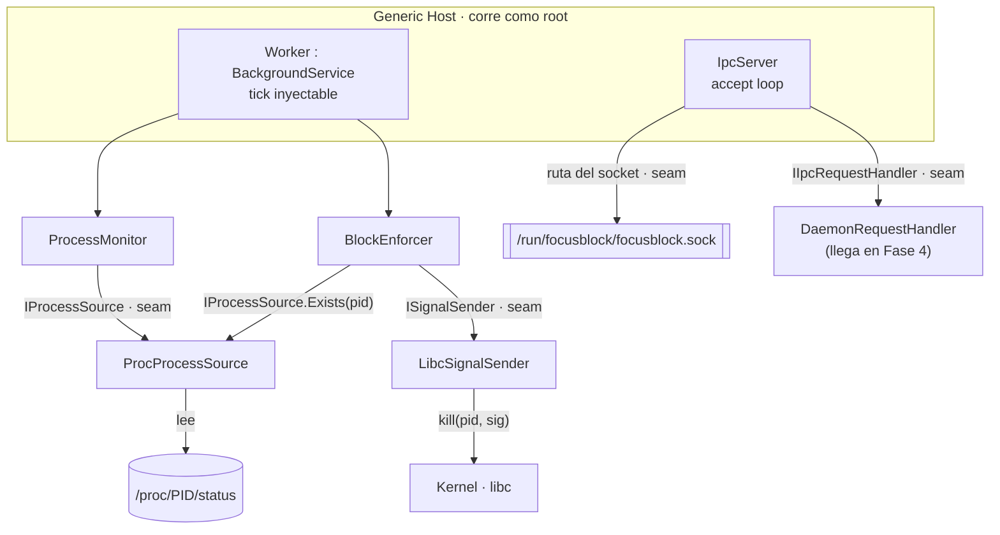
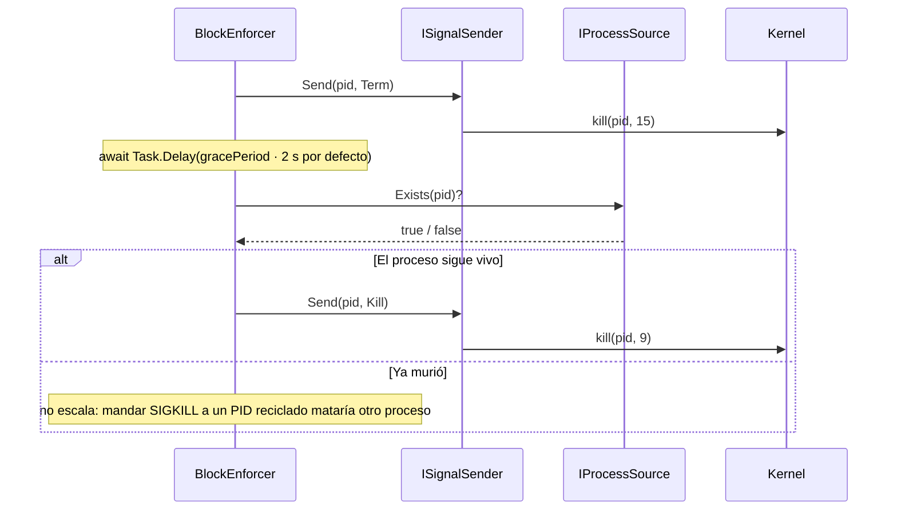

# Diagramas — Fase 3: Daemon, Procesos y Señales

Las dos vistas que más cuesta reconstruir leyendo archivos sueltos: dónde está cada seam del daemon
y cómo se ejecuta la escalación de señales.

## 1. El daemon y sus seams

Qué componente depende de qué, y en qué punto se inyecta un doble para testear sin kernel.

**Clave:** cada dependencia del kernel queda detrás de un seam (`IProcessSource`, `ISignalSender`,
ruta del socket, tick del `Worker`). En unit tests se reemplazan por dobles en memoria; los tests
marcados `Category=Integration` son los únicos que tocan `/proc` y procesos reales. En Fase 3 el
`IIpcRequestHandler` era un fake en tests; el handler real llegó con el `BlockEngine` de Fase 4.

**Patrones marcados:** Seam por dependencia del SO · Composition Root (`Program.cs`) · patrón
accept-loop con una task por conexión · handler inyectado (`IIpcRequestHandler`).

## 2. Escalación SIGTERM → SIGKILL

La secuencia exacta de un kill educado: pedir, esperar, verificar y recién ahí forzar.

**Clave:** `SIGTERM` (15) se puede capturar: le da al proceso la chance de guardar y cerrar.
`SIGKILL` (9) no se puede capturar ni ignorar: garantiza la muerte pero no da chance. Entre ambos hay
una verificación de vida, porque escalar a ciegas sobre un PID que ya murió (y pudo reciclarse) sería
peligroso. La race completa se documenta en `BlockEnforcer`: la mitigación total compara el start-time
de `/proc/PID/stat`.

**Patrones marcados:** Escalación con período de gracia · P/Invoke a `kill()` · verificación de
liveness antes de forzar · límite conocido (reuso de PID).
