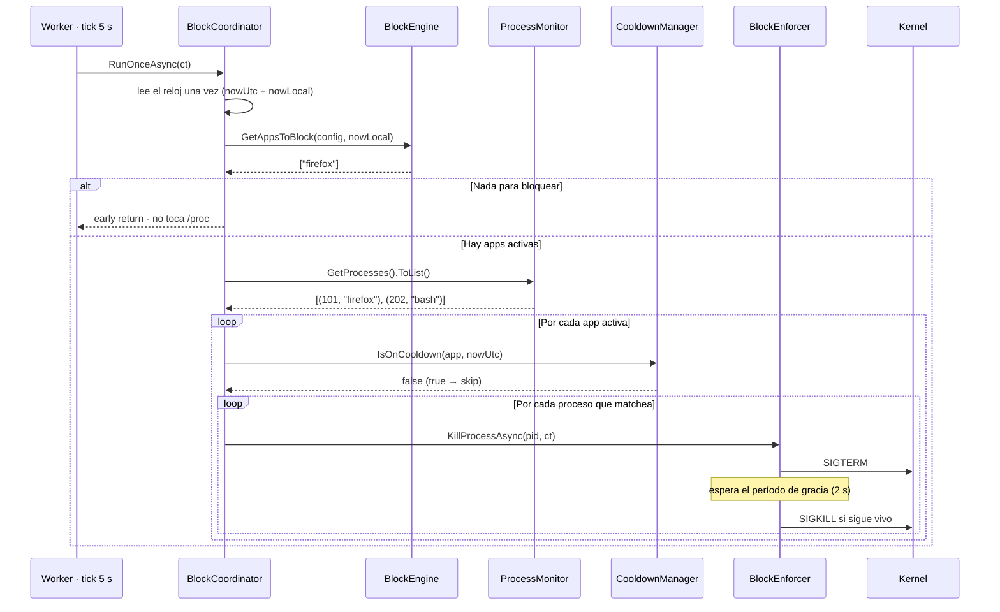
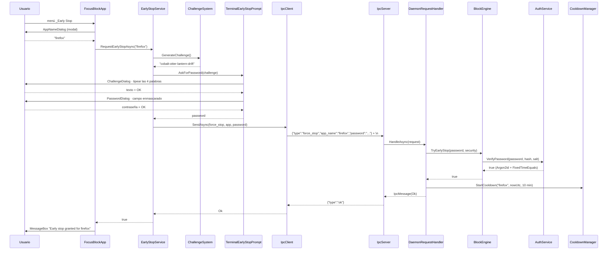

# Diagramas — Fase 4: Núcleo del Bloqueador

Los dos flujos que sostienen la fase: una pasada de bloqueo completa y el early stop cruzando la
frontera TUI ↔ daemon.

## 1. Una pasada de bloqueo (tick del Worker)

Qué pasa entre que el `Worker` despierta y el kernel recibe la señal.

**Clave:** el reloj se lee **una sola vez** por pasada: reglas y cooldowns se evalúan contra el mismo
instante. `/proc` también se lee una sola vez y se materializa con `.ToList()` (el escaneo es lazy).
El `HashSet` de PIDs matados evita señales duplicadas cuando dos reglas activas apuntan a la misma
app. Si no hay apps activas, el early return evita tocar `/proc` por completo.

**Patrones marcados:** orquestador delgado (`BlockCoordinator` sin política propia) · función pura
(`BlockEngine.Evaluate`) · colección concurrente (`CooldownManager`) · dedup de PIDs · escalación de
señales (`BlockEnforcer`).

## 2. Early stop: TUI ↔ daemon

El camino completo de la válvula de escape, desde el menú hasta el cooldown.

**Clave:** la decisión vive en el daemon (root); la TUI solo aporta fricción y transporte. La
contraseña viaja por el socket pero **nunca se hace eco** en la respuesta. Tres caminos de falla que
no aparecen en el diagrama: (1) cancelar cualquier diálogo → `false` sin enviar IPC; (2) contraseña
incorrecta → el daemon responde `error` y **no** arranca cooldown; (3) daemon caído → `SocketException`
capturada en `EarlyStopService` y `false`. El resultado se muestra marshalado al hilo de UI con
`_app.Invoke(...)`.

**Patrones marcados:** fricción + seguridad en dos pasos (challenge → password) · contrato IPC
compartido (`force_stop`) · validación del lado confiable · degradación elegante (daemon ausente) ·
marshal de vuelta al hilo de UI.
